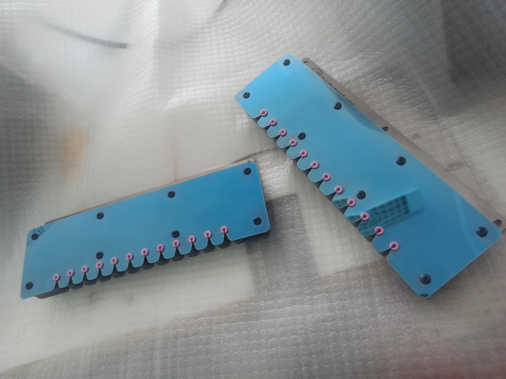
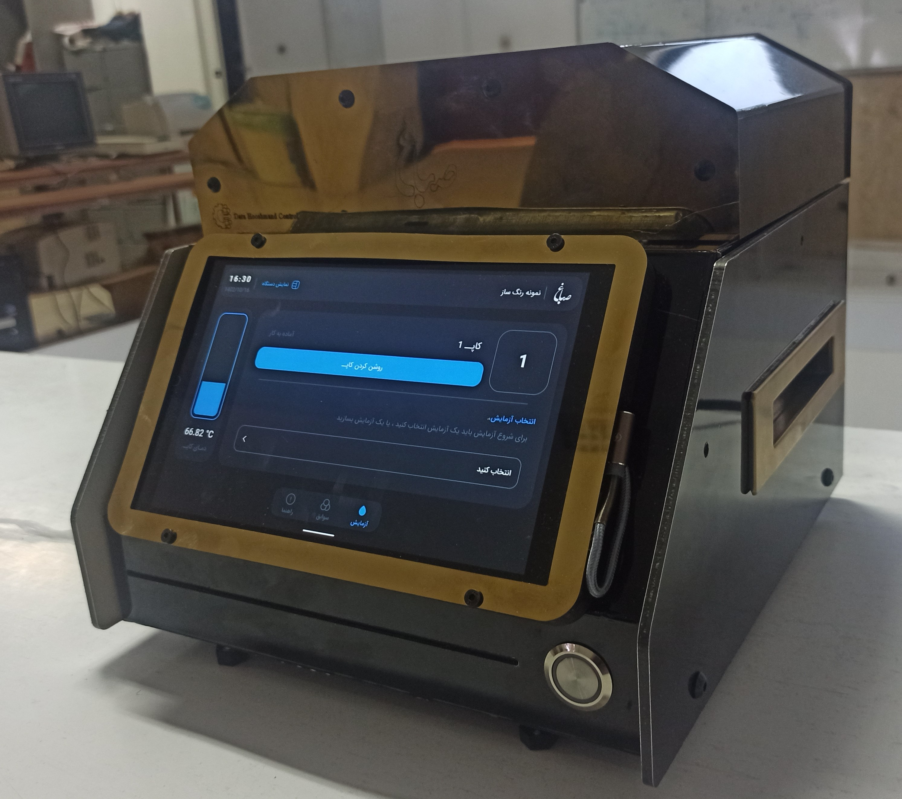

# Dara_Smart_Control_PORTFOLIO

                            Industrial Embedded Systems & Intelligent Automation Portfolio

Dara Smart Control develops industrial embedded systems, intelligent sensing platforms, and automation solutions integrating electronics, firmware, control algorithms, and mechanical engineering.
This portfolio presents selected industrial products and engineering projects developed by Dara Smart Control, including embedded firmware, electronic systems, mechanical design, control algorithms, and industrial prototypes.

Featured Products & Engineering Solutions

1.	Yarn Detect Smart Sensor
2.	Industrial Textile Color Mixing Machine
3.	@Work Robot Electronics Platform (PCB engineering project)
4.	Wireless Industrial Robot Controller (Firmware development)
________________________________________

# Core Engineering Capabilities

Dara Smart Control provides complete product development from concept to industrial prototype, integrating embedded software, electronics, mechanical engineering, and intelligent control systems.

## Embedded Systems & Firmware Development

- STM32-based embedded systems

- Real-time embedded firmware development

- ADC/DMA-based signal acquisition

- Timer and PWM control

- Sensor interfacing and signal processing

- Motor and actuator control

- Communication protocols:CAN / RS-485 / UART / SPI / I²C / Wireless communication (nRF24L01)
- Embedded debugging and prototype validation

## Electronics & PCB Design

Dara Smart Control designs custom embedded electronics for industrial automation and intelligent sensing applications.

### Hardware Design Expertise

- STM32-based embedded systems
  
- Multi-layer PCB design
  
- Mixed-signal analog and digital circuits
  
- Industrial-grade components
  
- Galvanic isolation
  
- Digital communication interfaces
  
- CAN, RS-485, Ethernet, USB, SPI, I²C, UART
  
- Sensor interface circuits
  
- Motor driver electronics
  
- Power supply design
  
- EMI / EMC / ESD-aware PCB layout
  
- Design for Manufacturing (DFM)
  
- Design for Assembly (DFA)
  
- Prototype validation and testing

## Industrial Automation & Control Systems

- Industrial process automation

- Temperature control systems

- PID controllers

- Adaptive calibration algorithms

- State-machine based control

- Trajectory generation

- HMI integration

- Data monitoring and logging

## Mechanical Product Development

- Industrial product mechanical design
  
- Sensor housing design

- Assembly design

- Prototype development

- 3D CAD modeling

- Manufacturing-oriented mechanical design
--------------------------------------------------

                            1.  Industrial Yarn Detect Smart Sensor

Dara Smart Control developed an industrial optical yarn detection system for textile machinery, combining high-speed embedded processing, adaptive signal analysis, and custom mechanical/electronic design. The system was designed from prototype stage to industrial deployment, including sensor electronics, embedded firmware, communication architecture, and mechanical integration.

Product Description

•	Real-time optical yarn breakage detection

•	Designed for industrial textile machines

•	High-speed sensor signal acquisition

•	Embedded intelligent detection algorithms

Embedded Features:

•	STM32G0/G4 microcontroller platforms

•	Adaptive signal processing

•	CAN communication

•	NRF24 wireless communication

•	Timer-triggered high-speed sampling

•	ADC and DMA-based acquisition

•	Timer and PWM control

•	WS2812 LED control

•	IR communication

•	UART / I2C / SPI interfaces

•	Industrial prototype development

Firmware Repositories:

[12-Channel Yarn Detection Sensor_firmware](https://github.com/darasmartcontrol/STM32_12Channel_Yarn_Detection_Optical-Sensor)

[Prototype Detection Sensor_firmware](https://github.com/darasmartcontrol/STM32_REAL_TIME_Prototype_Detection_Optical_Sensor)

[CAN Bus Yarn Sensor_firmware](https://github.com/darasmartcontrol/Stm32_Yarn_Sensor_CANBus)

Hardware & Mechanical Design:

[12-Channel Yarn Detection Sensor_Hardware](https://github.com/darasmartcontrol/Hardware-Mechanical-Design/tree/main/12%20channel_optic_yarn%20detect%20sensor)

[6-Channel Yarn Detection Sensor_Hardware](https://github.com/darasmartcontrol/Hardware-Mechanical-Design/tree/main/6%20channel_optic_yarn%20detect%20sensor)

[2-Channel Yarn Detection Sensor_Hardware](https://github.com/darasmartcontrol/Hardware-Mechanical-Design/tree/main/2_channel_sensor))

[Prototype Detection Sensor_Hardware](https://github.com/darasmartcontrol/Hardware-Mechanical-Design/tree/main/prototype_detection_textile_sensor)

## PCB Design

[PCB Design Gallery](https://github.com/darasmartcontrol/PCB_Design/tree/main/Textile_machine_sensors)

### Highlights

- Analog signal conditioning and noise reduction
  
- 4-layer industrial PCB
  
- Low-noise analog front-end
  
- High-speed STM32G4 controller
  
- CAN communication
  
- Industrial optical sensor interface

                             2. Industrial Textile Dye Mixing Machine
                                          
Dara Smart Control developed an embedded control system for an industrial textile color mixing machine, providing accurate temperature control, process automation, and human-machine interface integration.

System  Features:

• PID temperature controller 

• User-defined temperature-time profiles 

• Piecewise linear trajectory generation 

• Automatic calibration mode 

• Reference trajectory prediction (temperature )

• Heater TRIAC phase-angle control 

• Cooling fan control 

• Custom serial communication protocol 

• HMI integration 

•	NeoPixel-based process indication 

• Process monitoring and logging 

• Automatic shutdown management

Hardware Platform:

• STM32G431 microcontroller

• TRIAC heater control

• Thermistor temperature measurement

• Cooling fan system

• NeoPixels indicators

• HMI tablet interface

Control Algorithms:

• Median filtering 

• Piecewise linear interpolation 

• Adaptive calibration 

• PID controller 

• State machine based process control

Design Repository:

[Industrial Color Mixing Machine Design](https://github.com/darasmartcontrol/Hardware-Mechanical-Design/tree/main/Color_maker)

Firmware repository:

[Industrial Color Mixing Machine firmware](https://github.com/darasmartcontrol/Industrial-Color-Mixing-Machine)

## PCB Design

[PCB Design Gallery](https://github.com/darasmartcontrol/PCB_Design/tree/main/Dye_mixing_machine)

### Highlights

Our PCB designs commonly incorporate:

- Industrial-grade components
  
- Galvanic isolation
  
- Multi-layer PCB architecture
- 
- High-speed communication interfaces
  
- STM32 microcontrollers
  
- Robust power distribution
  
- EMC/ESD-conscious layout
  
- Design for Manufacturing (DFM)

                           3. Industrial PCB Design Projects

@Work Robot — Robotic Platform Electronics Design

Role: Electronics Design Engineer

Contribution: PCB design, hardware architecture, component selection, and manufacturing preparation

Project Overview:

Designed the main electronic control PCB for an industrial robotic platform. The board integrates power management, motor control interfaces, communication modules, and peripheral connections required for robot operation.

Key Hardware Features:

- Multi-layer PCB design for industrial robotic application

- STM32-based embedded control architecture 

- Motor driver interfaces

- Power supply and voltage regulation circuits

- Protection circuits (reverse polarity, over-current, filtering)
  
- Communication interfaces:CAN / RS485 / UART / SPI / I2C (only list what exists)

- Sensor and actuator connectors

- EMI/EMC-aware layout considerations

- Manufacturing-ready design documentation

Engineering Work:

Schematic capture

PCB layout and routing

Component selection

Design for manufacturability (DFM)

Production files generation (Gerber, BOM, Pick & Place)

Tools:

Easy EDA

Datasheet analysis

                            4. Wireless Industrial Robot Controller
                            
Dara Smart Control developed a wireless embedded controller based on two STM32 microcontrollers and an nRF24L01 communication system.                                             
 Hardware Architecture
 
Transmitter

STM32G030K6T6

Features:

•	Dual analog joysticks

•	Four ADC channels

•	Four push buttons

•	Battery voltage monitoring

•	WS2812 NeoPixel status LEDs

•	Timer + DMA LED driver

•	Buzzer interface

•	nRF24L01 wireless communication using SPI

Receiver

STM32G030C8T6

Features:

•	Four DC motor PWM outputs

•	Two servo motor outputs

•	nRF24L01 wireless communication

Embedded Features

•	STM32 HAL-based firmware

•	DMA ADC acquisition

•	DMA-driven WS2812 LED driver

•	SPI communication

•	nRF24L01 automatic acknowledgement and retransmission

•	Dynamic payload support

•	Wireless binding system

•	Flash memory storage

•	Battery monitoring

•	Multi-channel motor control

Firmware Repository

[NRF24 Robot Controller](https://github.com/darasmartcontrol/STM32_NRF24_Robot_Controller)

## Technologies

Microcontrollers:

- STM32G0 / STM32G4

Communication:

- CAN
  
- RS485
  
- NRF24L01
  
- UART
  
- SPI
  
- I2C

Embedded:

- STM32 HAL
  
- DMA
  
- Timer peripherals
  
- ADC acquisition
  
- PWM control

Software:

- STM32CubeIDE
  
- MATLAB/Simulink
  
- EasyEDA

Design:

- PCB Design
  
- SolidWorks
  
- Mechanical integration
-----------------------------------------
                                         
                          About Dara Smart Control

Dara Smart Control focuses on developing intelligent embedded solutions that combine:

•	Embedded firmware

•	Industrial electronics

•	Sensor systems

•	Control engineering

•	Mechanical product development

•	Industrial automation

Our goal is to transform engineering concepts into reliable industrial products.

